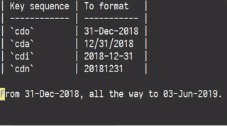

# outdate.vim <sup>&beta;</sup>

**Requires +python3**

This is a little vim script to quickly change date formats. Supports repeating actions if tpope’s
vim-repeat plugin is installed, but this is optional.



## Default maps

| Normal mode | Visual mode | To format   |
| ----------- | ----------- | ----------- |
| `cdo`       | `do`        | 31-Dec-2018 |
| `cda`       | `da`        | 12/31/2018  |
| `cdi`       | `di`        | 2018-12-31  |
| `cdn`       | `dn`        | 20181231    |

## Add custom format mappings

Mappings to convert to custom formats may be defined by running something like the following:

```vim
OutdateMap %d-%b-%Y cdo do
```

The format strings to be passed to the `Outdate` function are Python `strftime` format patterns. More
details on official Python documentation at
<https://docs.python.org/3/library/datetime.html#strftime-and-strptime-behavior>.

## Parse formats

The variable `g:outdate_parse_formats` can be set to a list of Python date format strings and this
list of patterns will be used to find a date in the current line to work with. It’s default value
currently is:

```vim
let g:outdate_parse_formats = [
      \ '%d-%b-%Y',
      \ '%m/%d/%Y',
      \ '%Y-%m-%d',
      \ '%Y%m%d',
      \ ]
```

Note that setting this variable will override the defaults.

## Disable script

The script may be disabled from running by setting the variable `g:loaded_outdate` to `1`.

```vim
let g:loaded_outdate = 1
```

## Installation

Clone this repo into your `packpath`’s start folder or if you use a plugin manager like `vim-plug`,
the following should work fine.

```vim
Plug 'sharat87/outdate.vim'
```

## TODO

- [ ] Vim style documentation.
- [ ] Support times (not just dates).

## Support

This plugin is still in it’s early stages. If you have a suggestion or found a bug, let me know by
creating an issue on GitHub.

This project's source code is licensed using MIT License.
